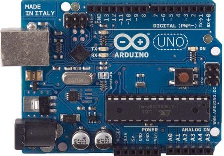
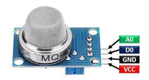
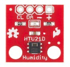
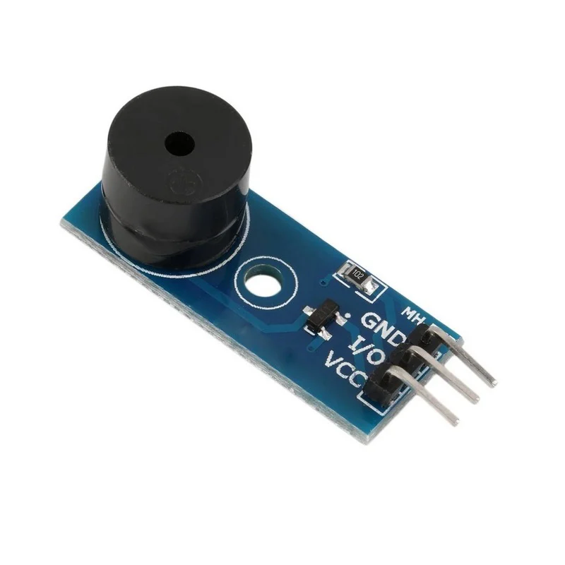

# Communication-devise-for-underground-mines
A receiver and transmitter node was developed in this project. For communication in underground mines, we have used the Lora communication protocol. The transmitter nodes also show data of gases in the working area of underground mines.

<h1>Content:</h1>
<a href="#obj" >1. Objective</a> 
<a href="#hardwere" >2. Harwere used </a> 

<a href="#IDE" >3. Softwere used</a> 
<a href="#app" >4. project completion stages </a> 
<a href="https://www.youtube.com/playlist?list=PLTU-KZj25vzZpi-RO7IZvw7ut81v-YkUq" >5. Youtube Demo</a> 

<h1 id="obj">1. Objective:</h1>
  
The underground mining environments across the world
      have distinct characteristics including topology and other
      physical and chemical features. As the main focus of my project
      is on the communication scheme inside the underground
      mines, the general conditions to be considered are
      underground topology, geological construction, line-of-sight,
      dielectric medium, gaseous environment, temperature and
      humid conditions. Amidst of these dynamically changing
      natural conditions, there arises a necessity to engineer a better
      communication scheme which can be an appropriate solution
      to the series of mine disasters all over the world.

  <h3> i. Existing system</h3>
  
 Coal mine communication systems are the
      usage of wired conversation. It is high-priced and makes
      problem to use wires in mines. Even measuring all
      parameters, it may crash if any catastrophe happens

  <h3> ii. Proposed System</h3>
  
This project is to develope a device by which communication can be done wirelessly.
    .this device will be Easy to monitor & manipulate by the use of lora communication module  And microcontrooler Arduino uno.
      we have integrated A gas sensor, alarm system, temperature and humidity sensor to sense mining enviroment and if required it will alarm to miners.
 
 

<h1 id="hardwere">2. Harwere used </h1>
 
<h3>Arduino Uno </h3>
Arduino Uno is a microcontroller board based on the ATmega328P . It has 14 digital input/output pins (of which 6 can be used as PWM outputs), 6 analog inputs, a 16 MHz quartz crystal, a USB connection, a power jack, an ICSP header and a reset button. It contains everything needed to support the microcontroller.
  
  
<h3>Methane sensor (MQ4)</h3>

This methane gas sensor detects the concentration of methane gas in the air and ouputs its reading as an analog voltage. The concentration sensing range of 300 ppm to 10,000 ppm is suitable for leak detection. For example, the sensor could detect if someone left a gas stove on but not lit. The sensor can operate at temperatures from -10 to 50°C and consumes less than 150 mA at 5 V.

 
 
<h3>Temperature and Humidity sensor(HTU21D) </h3>
 
<h3>low Level triggered Alarm buzzer </h3>
<!--

After pre-processing we split the data into train and validation set in the ratio 7:3. The number
of observation per class in our dataset is not equally distributed, it varies between 20.82% for
majority class to 1.69% for minority class. To tackle this issue we apply smote oversampling
technique on training dataset only and leave validation dataset as it is. After getting balanced
training data we grouped training data in the batch size of 16, and feed it into our proposed
model.

During training, the input to our model is a 3D-data of size (patch size, patch size, dnew). The
data is passed through a stack of 3D-Convolution layers, where we use 3D kernel of size
(3,3,3) in first convolution block and (5,3,3) in rest two convolution block. Each 3D-
Convolution layer is followed by BatchNorm3D layer. We used relu activation unit for every
layer except the last layer where we used tanh activation unit.

<h1 id="res">2. Result:</h1>

Below is the classification report obtained on the validation dataset for patch size = 9 and
dnew = 20 on salinas dataset.

<h3>Predicted Crop map</h3>

<h3>Ground Truth Crop map</h3>

<h3>Estimated Area on salinas dataset</h3>

<h1 id="app">5. Appendix:</h1>

<h4>Abbreviation:</h4>
W: Width of HSI 
H: Height of HSI 
D: Number of Spectral band  in HSI 
Dnew: Number of Spectral band in HSI after PCA 
W': Width of HSI after padding with zero. 
H' : Height of HSI after padding with zero. 
P: Patch size 
HSI: Hyperspectral Image 

<h4>Reference:</h4>

[1]<a href="http://www.ehu.eus/ccwintco/index.php/Hyperspectral_Remote_Sensing_Scenes">Salinas dataset</a>

[2]<a href="https://arxiv.org/abs/1902.06701">HybridSN: Exploring 3-D–2-D CNN Feature
Hierarchy for Hyperspectral Image Classification</a>

-->
